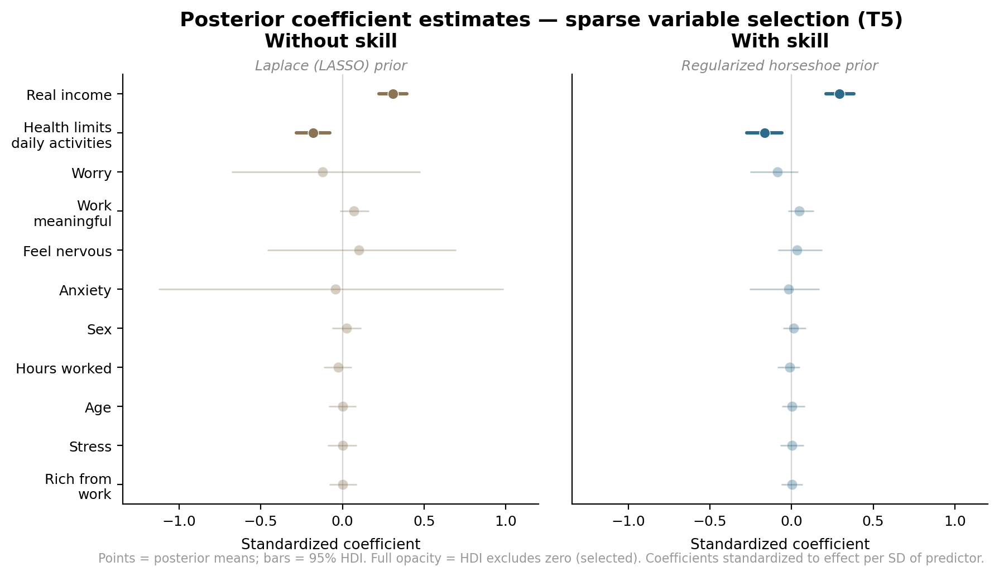
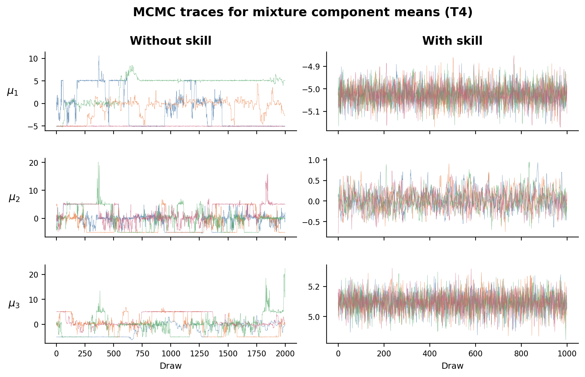

# Benchmarking Claude Code Skills for Bayesian Modeling with PyMC

*Chris Fonnesbeck — PyMC Labs*

Claude Code's [skills](https://docs.anthropic.com/en/docs/claude-code/skills) feature lets you inject domain expertise directly into the system prompt, via a markdown document covering API patterns, best practices, and implementation guidance for a specific domain.
Without a skill, an LLM knows PyMC's syntax—the classes, methods, and basic model structure—but it won't necessarily have more nuanced information like non-centered parameterizations, which priors work best for specific problems, or modern tooling like `nutpie`.
Training data catches up, but slowly and unevenly.
We built a `pymc-modeling` skill to cover PyMC's current best practices and optimal workflows: model specification, parameterization strategies, sampling configuration, convergence diagnostics, and model comparison.

The question is whether this knowledge actually produces better models when injected into Claude Code's system prompt—particularly on sophisticated tasks where implementation details matter.
We built a benchmark to find out.

## What We're Measuring

What constitutes a successful model run is hard to objectively define. For some, having Claude Code return a model that simply runs, eliminating the blank page problem, would be a win. 
For others, a model that runs but produces divergent transitions and low effective sample size isn't a success at all. 
We created a multi-criteria evaluation framework to capture the different dimensions of success:

- **Does it run at all?**
  The model may fail to sample — producing errors, hanging, or timing out before generating any posterior draws.
- **Does it converge?**
  MCMC can run to completion but produce unreliable inference: divergent transitions, low effective sample size, R̂ well above 1.
- **Is it the right model?**
  Multiple model specifications may be valid for a given problem, but some are substantially better than others.
  Choosing a Laplace (LASSO) prior when a regularized horseshoe is more appropriate isn't *wrong* — it will fit — but it's a suboptimal choice that sacrifices performance.
  Similarly, using a centered parameterization when the data call for non-centered isn't a bug, but it leads to harder posterior geometry and worse inference.
- **Does it follow modern best practices?**
  Labeled dimensions (`coords`/`dims`), efficient samplers (`nutpie`/`numpyro`), reproducibility (`random_seed`), posterior predictive checks — these don't affect whether the model runs, but they determine whether the output is production-ready.

We want to measure all of these dimensions, and we want to replicate our measurements, because LLM outputs are stochastic.

## Benchmark Design

### The Intervention

The benchmark compares two conditions:

| Condition | Description |
|-----------|-------------|
| `no_skill` | Claude Code with base knowledge only |
| `with_skill` | Claude Code with the `pymc-modeling` skill injected via `--append-system-prompt` |

Both conditions use identical Claude CLI flags, identical tools (`Bash`, `Read`, `Write`, `Glob`, `Grep`), and identical prompts.
The only difference is the system prompt injection.
Crucially, the prompts describe *statistical problems* — they never mention PyMC-specific patterns or hint at implementation approaches.
The skill's value is knowing which tools and patterns to reach for when solving a particular problem.

### Five Tasks, Escalating Difficulty

When designing the tasks, we wanted to cover a range of modeling challenges that are common in applied Bayesian work, and where implementation details make a difference.
There is a nearly-unlimited set of possible tasks, but we focused on five that are well-known, have clear best practices, and represent different modeling challenges.
Each task targets something the skill explicitly teaches.
We excluded very basic models (linear regression, simple logistic regression) where Claude should perform very well without help — the goal is to probe the boundary where base knowledge runs out and domain expertise makes a difference.

Bayesian models are uniquely challenging for AI coding agents because success isn't just about writing syntactically correct code.
The model must specify a generative story for the data — priors, likelihoods, and their parameterization — and then an MCMC sampler must be able to efficiently explore the resulting posterior geometry.
A wrong choice at the specification stage (say, a centered parameterization for a hierarchical model with weak data) produces code that runs without errors but generates thousands of divergent transitions and unreliable inference.
These failure modes are invisible to an agent that only checks whether code executes; they require domain knowledge about what makes a posterior well-behaved.
With that in mind, we chose five tasks that each target a different point where this gap between "code that runs" and "code that works" tends to open up.

| Task | Problem | What the Skill Teaches |
|------|---------|----------------------|
| **T1** | Hierarchical model (8 schools) | Non-centered parameterization, divergence diagnosis |
| **T2** | Ordinal regression (GSS survey) | `OrderedLogistic`, ordered transforms |
| **T3** | Stochastic volatility (S&P 500) | `GaussianRandomWalk`, Student-T likelihood, exp transform |
| **T4** | Gaussian mixture model | `NormalMixture`, Dirichlet weights, ordered means for label switching |
| **T5** | Sparse variable selection | Regularized horseshoe prior, `target_accept=0.99` |

### Execution

The benchmark allows Claude to run in agentic mode with tool access.
For each task, it writes a `model.py` file and executes it via the `Bash` tool, observing any errors or diagnostics.
Each run is capped at $2.00 and 10 minutes wall-clock time.
Runs execute in isolated temporary directories with no access to the skill file, project configuration, or session history from other runs.

Each task runs 3 times per condition (30 total runs), with conditions interleaved for fairness.

### Isolation

Critically, the benchmark must ensure that the `no_skill` condition has zero access to skill content. To this end, we take multiple mitigation steps to isolate the conditions and prevent leakage:

| Risk | Mitigation |
|------|------------|
| Skill tool loads `~/.claude/skills/` | Excluded from `--tools` list |
| Slash commands invoke skills | `--disable-slash-commands` |
| Plugin hooks suggest the skill | Working dir is `/tmp/benchmark/`, not the repo |
| Session state leaks between runs | `--no-session-persistence` |
| Permission prompts block execution | `--dangerously-skip-permissions` |

Both conditions use an explicit tool allowlist (`Bash`, `Read`, `Write`, `Glob`, `Grep`), which excludes not only the `Skill` tool but also `WebSearch` and `WebFetch`.
This means the `no_skill` condition cannot compensate by looking up PyMC documentation online — but neither can the `with_skill` condition.
We chose this constraint deliberately: web search would introduce uncontrolled variance (network latency, page availability, search result quality) that would make results harder to attribute and reproduce.
The benchmark is trying to evaluate whether injected domain knowledge improves code generation, not whether it beats web search.

## Evaluation: Two Stages, Not One Score

To capture the different dimensions of success, we use a two-stage, hierarchical evaluation process. The first stage is a viability gate — a binary pass/fail that checks whether the model runs and produces non-degenerate output, while the second stage is a multi-criteria quality scoring that assesses convergence, model appropriateness, best practices, and process metrics like thrashing (getting stuck in decision loops) and efficiency.

### Stage 1: The Viability Gate (Pass/Fail)

A run **passes** if all three conditions hold:

1. **Sampling completed**: `results.nc` exists with a posterior group containing >100 draws
2. **Convergence acceptable**: R̂ < 1.05 for most parameters, fewer than 100 divergent transitions
3. **Non-degenerate estimates**: All posterior means are finite, at least one variable has non-zero posterior standard deviation

This is a low bar — it's asking "did the model produce output that a practitioner could meaningfully examine?"
Many runs fail to clear it.

### Stage 2: Quality Scoring (0–30)

Runs are scored on six criteria, each worth 0–5 points:

| Criterion | Method | What It Measures |
|-----------|--------|------------------|
| **Model produced** | Automated | Completeness of InferenceData (posterior predictive, log-likelihood) |
| **Convergence** | Automated | R̂, ESS, divergence counts computed from the `.nc` file |
| **Model appropriateness** | LLM judge | Is the model the right choice for this problem? Task-specific rubric |
| **Best practices** | Automated (regex) | coords/dims, nutpie, random_seed, task-specific patterns |
| **Thrashing** | Automated | How many error-fix rewrite cycles before a working model? |
| **Efficiency** | Automated | Total turns used (fewer = better) |

The **model appropriateness** criterion uses an LLM judge (Claude Haiku) with a structured rubric per task.
For example, the horseshoe task rubric distinguishes between any shrinkage prior (score 1), a global-local shrinkage structure (score 2), a regularized/slab variant (score 3), appropriate sampler tuning (score 4), and clear identification of important variables (score 5).
If the judge fails, scoring falls back to regex-based pattern matching.

The **thrashing** and **efficiency** criteria measure the *process*, not just the product.
For example, a model that works on the first try likely reflects better domain knowledge than one that requires four rewrite cycles, even if the final output is identical.

## Results

### Stage 1: Can It Build a Working Model?

| Task | no_skill Pass Rate | with_skill Pass Rate |
|------|-------------------|---------------------|
| T1 — Hierarchical | 100% | 100% |
| T2 — Ordinal | 100% | 100% |
| T3 — Stochastic Volatility | **0%** | **33%** |
| T4 — Mixture | 67% | **100%** |
| T5 — Horseshoe | **33%** | **100%** |
| **Overall** | **60%** | **87%** |

Both conditions handle the hierarchical model and ordinal regression tasks with 100% pass rates.
These are well-documented patterns in the training data, and hence the skill doesn't provide a noticeable boost.

The trajectory of success then begins to diverge on increasingly specialized tasks.
Without the skill, Claude fails to produce viable output more often than it succeeds — a 60% overall pass rate, pulled down by 0% on stochastic volatility and 33% on horseshoe regression.
With the skill, the pass rate jumps to 87%.

Stochastic volatility is the starkest example; without the skill, Claude attempts complex custom parameterizations — manual ar(1) processes with centered parameterizations — and none of the three runs produce converged output.
With the skill, Claude reaches for `GaussianRandomWalk` and `StudentT` (the patterns the skill teaches), and one of three runs passes (a second run produced valid samples but exceeded the 10-minute timeout cap).
The skill doesn't make Claude understand time series better — it merely nudges Claude to the right PyMC abstraction for the job.

### What the Code Looks Like

The qualitative differences between conditions are most visible on the sparse variable selection task.
Both snippets below are extracted from actual benchmark runs — the model specification and sampling call, with data loading and post-processing trimmed for brevity.

**Without the skill**, Claude builds a standard horseshoe prior with `HalfCauchy` scales and a centered parameterization:

```python
with pm.Model() as model:
    # Global shrinkage
    tau = pm.HalfCauchy("tau", beta=1)
    # Local shrinkage — one per predictor
    lambda_i = pm.HalfCauchy("lambda", beta=1, shape=n_predictors)
    sigma_beta = tau * lambda_i

    # Centered coefficients
    beta = pm.Normal("beta", mu=0, sigma=sigma_beta, shape=n_predictors)
    eta = pm.math.dot(X, beta)

    # Manually ordered cutpoints
    c1 = pm.Normal("c1", mu=0, sigma=2)
    delta = pm.Exponential("delta", lam=1)
    cutpoints = pm.Deterministic("cutpoints", pm.math.stack([c1, c1 + delta]))

    y_obs = pm.OrderedLogistic("y_obs", eta=eta, cutpoints=cutpoints, observed=y)

    trace = pm.sample(2000, tune=1000, target_accept=0.95, random_seed=42,
                      chains=4, return_inferencedata=True)
```

Note `shape=n_predictors` instead of `dims`, no `coords`, no `nutpie`, and a centered parameterization where the coefficients are drawn directly from `Normal(0, sigma_beta)`.
The cutpoints are manually ordered via an exponential offset — functional, but fragile.

**With the skill**, Claude implements the regularized horseshoe (Finnish horseshoe) with a non-centered parameterization and slab regularization:

```python
coords = {
    "obs": np.arange(n_obs),
    "features": predictors,
    "cuts": np.arange(n_categories - 1),
}

with pm.Model(coords=coords) as model:
    X_data = pm.Data("X", X_scaled, dims=("obs", "features"))

    # Regularized horseshoe
    tau = pm.HalfStudentT("tau", nu=2, sigma=1)
    lam = pm.HalfStudentT("lam", nu=5, dims="features")
    c2 = pm.InverseGamma("c2", alpha=1, beta=1)

    # Non-centered parameterization
    z = pm.Normal("z", mu=0, sigma=1, dims="features")
    lam_tilde = pt.sqrt(c2 / (c2 + tau**2 * lam**2))
    beta = pm.Deterministic("beta", z * tau * lam * lam_tilde, dims="features")

    # Built-in ordered transform
    cutpoints = pm.Normal("cutpoints", mu=[-1, 1], sigma=1,
                          transform=pm.distributions.transforms.ordered, dims="cuts")
    eta = pm.math.dot(X_data, beta)
    y_obs = pm.OrderedLogistic("y", eta=eta, cutpoints=cutpoints, observed=y, dims="obs")

    idata = pm.sample(draws=1000, tune=1000, chains=4, nuts_sampler="nutpie",
                      random_seed=42, target_accept=0.95, init="adapt_diag")
```

The differences span several dimensions:

| Aspect | Without Skill | With Skill |
|--------|--------------|------------|
| **Prior structure** | Standard horseshoe (`HalfCauchy`) | Regularized horseshoe with slab (`HalfStudentT` + `InverseGamma`) |
| **Parameterization** | Centered (harder posterior geometry) | Non-centered via auxiliary `z` |
| **Labeled dimensions** | `shape=n_predictors` | `coords`/`dims` throughout |
| **Cutpoints** | Manual ordering via `Exponential` offset | Built-in `ordered` transform |
| **Sampler** | Default PyMC (NUTS) | `nutpie` with `adapt_diag` init |
| **Data containers** | Raw numpy arrays | `pm.Data` for clean separation |

The regularized horseshoe adds a slab component (`c2`) that prevents the tails of the local shrinkage distribution from producing implausibly large coefficients — a refinement over the standard horseshoe that the skill explicitly teaches.
The non-centered parameterization decouples the coefficient values from the shrinkage scales, giving the sampler an easier geometry to explore.
These are precisely the patterns the skill document covers, and they translate directly into better convergence and more reliable variable selection.

### What the Posteriors Look Like

The code differences above aren't just stylistic — they produce measurably different posterior estimates.
The figure below shows the posterior coefficient distributions from both models, with 95% highest density intervals (HDI) for each predictor.
Coefficients are standardized so that each represents the effect per standard deviation of the predictor.
Full-opacity intervals indicate selected variables (HDI excludes zero); faded intervals indicate variables shrunk toward zero.



Both models correctly identify the same two predictors — real income (positive) and health limitations (negative) — as the only variables whose 95% HDI excludes zero.
But the quality of the selection differs starkly.
The Laplace prior leaves wide uncertainty bands on the noise variables: anxiety, feel nervous, and worry all span roughly ±1.0, giving a practitioner little confidence that these effects are truly negligible.
The regularized horseshoe, by contrast, compresses those same intervals to roughly ±0.25 — a fourfold reduction — making the distinction between signal and noise far cleaner.

This illustrates [a fundamental limitation of the Bayesian Laplace prior](https://dansblog.netlify.app/posts/2021-12-08-the-king-must-die-repost/the-king-must-die-repost): unlike the frequentist LASSO, which produces exact zeros via optimization, the Bayesian Laplace cannot simultaneously support both sparsity and large coefficients.
When scaled to concentrate mass near zero, the Laplace's exponential tails make large coefficients vanishingly improbable; the posterior compromises, leaving small coefficients too large and large coefficients over-shrunk.
The horseshoe prior solves this with its global-local structure: the Cauchy-like tails of each local shrinkage parameter allow genuinely large coefficients to escape shrinkage entirely, while the global scale pulls noise variables sharply toward zero.
The slab component (`c2`) in the regularized variant adds an additional ceiling that prevents the local scales from producing implausibly large estimates — the kind of refinement that the skill teaches but that Claude's base knowledge doesn't reliably produce.

### Stage 2: Quality Among Viable Models

| Task | Condition | Produced | Convergence | Appropriateness | Best Practices | Thrashing | Efficiency | Total |
|------|-----------|----------|-------------|-----------------|----------------|-----------|------------|-------|
| T1 | no_skill | 4.0 | 4.0 | 5.0 | 2.0 | 4.7 | 3.7 | 23.3 |
| T1 | with_skill | 4.7 | 4.7 | 5.0 | 4.0 | 4.7 | 4.0 | 27.0 |
| T2 | no_skill | 4.7 | 5.0 | 5.0 | 2.0 | 3.3 | 4.0 | 24.0 |
| T2 | with_skill | 4.7 | 5.0 | 5.0 | 4.7 | 2.3 | 3.3 | 25.0 |
| T3 | no_skill | 3.0 | 1.3 | 4.0 | 3.3 | 0.7 | 1.7 | 14.0 |
| T3 | with_skill | 5.0 | 2.7 | 4.3 | 5.0 | 2.3 | 3.7 | 23.0 |
| T4 | no_skill | 5.0 | 2.7 | 5.0 | 4.0 | 3.3 | 4.0 | 24.0 |
| T4 | with_skill | 5.0 | 5.0 | 4.7 | 5.0 | 3.0 | 2.7 | 25.3 |
| T5 | no_skill | 4.7 | 3.0 | 4.0 | 2.7 | 3.0 | 3.7 | 21.0 |
| T5 | with_skill | 4.3 | 3.7 | 5.0 | 5.0 | 4.0 | 3.7 | 25.7 |

**Best practices** show the most consistent improvement, with gains across every task: 2.0→4.0 (T1), 2.0→4.7 (T2), 3.3→5.0 (T3), 4.0→5.0 (T4), 2.7→5.0 (T5).
These are the concrete, teachable patterns — `coords`/`dims` for labeled dimensions, `nutpie` for sampling, `random_seed` for reproducibility.
Injected knowledge has its most reliable effect on turning implicit best practices into consistent behavior.
These patterns matter because they compound downstream: labeled dimensions make diagnostics interpretable, reproducible seeds make results verifiable, and efficient samplers reduce the chance of a run timing out before producing useful output.

**Convergence** improves on the hard tasks.
The mixture model jumps from 2.7 to 5.0 — the skill teaches the ordered transform for component means, which directly addresses the label-switching problem that causes convergence failures.
Stochastic volatility goes from 1.3 to 2.7 — still not great, reflecting the genuine difficulty of these models for MCMC.

The mixture model's convergence gap is visible in the raw MCMC traces.
Without the skill, Claude sorted the component means *after* sampling (`pt.sort(means_raw)`) — a post-hoc fix that doesn't actually constrain the sampler.
The chains are free to swap which component is which mid-run, producing the chaotic label-switching pattern on the left: traces that jump between modes, R-hat of 1.49, and an effective sample size of just 8 for the worst parameter.
With the skill, Claude applies PyMC's built-in `ordered` transform directly on the means, constraining the parameter space so that $\mu_1 < \mu_2 < \mu_3$ throughout sampling.
The result is the clean, well-mixed traces on the right — R-hat of 1.003 and ESS above 1,100.



**Model appropriateness** is where the skill shapes modeling choices.
The regularization task improves from 4.0 to 5.0 — without the skill, Claude reaches for Laplace (LASSO) priors, a natural choice but one that [fundamentally cannot perform variable selection in a Bayesian setting](https://dansblog.netlify.app/posts/2021-12-08-the-king-must-die-repost/the-king-must-die-repost).
With the skill, it implements the regularized horseshoe with the full global-local structure.
Both models fit; one is a better choice for the problem.

### Effect Sizes

We can use Cohen's d to quantify the magnitude of the skill's effect using a standardized scale (positive d = skill helps):

| Task | Total Score d | Interpretation |
|------|--------------|----------------|
| T1 — Hierarchical | 4.49 | Large |
| T2 — Ordinal | 0.45 | Small |
| T3 — Stochastic Volatility | 2.65 | Large |
| T4 — Mixture | 0.82 | Large |
| T5 — Horseshoe | 5.71 | Large |
| **Overall** | **1.16** | **Large** |

The overall effect size of **d = 1.16** is large by conventional standards.
The per-task breakdown reveals where the skill earns its keep: stochastic volatility and horseshoe regression show very large effects (specialized patterns Claude doesn't know well), while ordinal regression shows only a small improvement (it's relatively well-documented and within Claude's base competence).

### Cost and Efficiency

Beyond model quality, we want to know whether the skill affects how efficiently Claude works — both in terms of compute cost and time to solution.

Wall times are winsorized at the 10-minute timeout cap — two runs that escaped the timeout mechanism (one at 4.5 hours, another at 49 minutes) are capped at 600s and counted as failures.

| Task | Condition | Mean Turns | Mean Wall Time | Mean Cost |
|------|-----------|-----------|----------------|-----------|
| T1 — Hierarchical | no_skill | 10.0 | 86s | $0.27 |
| T1 — Hierarchical | with_skill | 8.7 | 84s | $0.36 |
| T2 — Ordinal | no_skill | 11.7 | 161s | $0.43 |
| T2 — Ordinal | with_skill | 14.7 | 197s | $0.68 |
| T3 — Stochastic Vol | no_skill | 11.0 | 481s | $0.49 |
| T3 — Stochastic Vol | with_skill | 11.0 | 350s | $0.87 |
| T4 — Mixture | no_skill | 8.3 | 265s | $0.46 |
| T4 — Mixture | with_skill | 18.7 | 364s | $1.12 |
| T5 — Horseshoe | no_skill | 11.7 | 359s | $0.51 |
| T5 — Horseshoe | with_skill | 12.0 | 171s | $0.53 |
| | | | | |
| **All tasks** | **no_skill** | **10.5** | **271s** | **$0.43** |
| **All tasks** | **with_skill** | **13.0** | **233s** | **$0.71** |

The skill-equipped agent costs more on average ($0.71 vs $0.43 per run, $10.63 vs $6.46 total) and uses more turns (13.0 vs 10.5), but is actually *faster* in wall-clock time (233s vs 271s).
The skill pushes Claude toward more sophisticated model specifications — regularized horseshoe instead of Laplace, mixture models with ordered transforms — and these more complex models require more iteration to get right.

However, the cost picture is more nuanced than the averages suggest.
On the horseshoe task, the with_skill agent is *faster* (171s vs 359s) because it gets the parameterization right earlier instead of thrashing through failed attempts.
The no_skill agent's lower cost partly reflects runs that failed quickly — producing no viable output is cheap.

The total benchmark cost was **$17.09 for 30 runs** — modest enough to run regularly during skill development.

## What We Learned

### Running code is not the same as getting correct results

Just because the agent produces code that executes without errors does not mean the results are correct or trustworthy.
A model can sample successfully and still have poorly chosen priors, undiagnosed convergence issues, or an inappropriate likelihood.
This is why our evaluation separates viability — did it run? — from quality — is the output actually good?
If we had only computed quality scores, the no_skill condition's 60% pass rate would be hidden inside lower averages, as would the with_skill condition's 87%.
The viability gate tells a fundamentally different story: the skill's biggest impact isn't making good models better, it's making hard models *work at all*.

### Domain skills make the agent more consistent, not smarter

The skill does not make Claude understand Bayesian statistics more deeply.
What it does is increase the probability that Claude applies well-established modeling patterns correctly.
The improvement we observe is behavioral rather than cognitive: more consistent use of stable parameterizations, appropriate priors, and known best practices.
This matters most on frontier tasks — stochastic volatility, horseshoe priors, mixture identifiability — where base Claude struggles and the skill makes the difference between a failed run and a working model.
On well-documented patterns like hierarchical models, Claude's base training is already sufficient, and the skill adds little.

### Process metrics matter for operations

Final output quality is not the whole picture.
You also need to measure how long it took, how many times it failed, and how much compute it consumed to get there.
A model that works on the first write reflects better domain knowledge than one that requires four error-fix cycles, even if both produce roughly the same final model.
On the horseshoe task, the skilled agent was *faster* (171s vs 1,135s) because it got the parameterization right earlier instead of thrashing through failed attempts.
For practitioners evaluating whether to adopt these tools, the cost of iteration matters as much as the quality of the final result.

### Replicate and choose tasks that differentiate

LLM outputs are stochastic; treat them accordingly.
The horseshoe task without the skill produced pass rates of 0/1/0 across three runs — one lucky success out of three attempts.
A single run would have given us either "it works" or "it doesn't," both misleading.
And when designing benchmarks, choose problems at the frontier of the model's capability.
The hierarchical and ordinal tasks showed ceiling effects in both conditions — too easy to distinguish skill from no-skill.
The informative tasks are the ones where base Claude struggles and the skill has room to help.

---

The silent failure modes we measured — models that run but produce unreliable inference — carry real organizational risk. In clinical trials, A/B testing, or risk modeling, a plausible-looking but poorly parameterized model doesn't surface as a bug; it surfaces as a bad decision. Skills don't eliminate that risk, but they shift the odds measurably toward the patterns a domain expert would choose.

What makes this approach worth investing in is that it compounds. The skill document is version-controlled, reviewable, and cheaply updated as APIs evolve or best practices shift. When a team discovers that `nutpie` silently drops log-likelihood under certain conditions, or that ArviZ renamed its comparison columns, that fix propagates to every future agent session — not through retraining, but through a markdown edit. The cost of maintaining a skill is trivial compared to the cost of debugging the same domain-specific failure across multiple analysts and projects.

Larger models will eventually internalize more of this knowledge through training data. But "eventually" is not a strategy for teams shipping analyses now, and training data will always lag the current state of fast-moving libraries. Skills give organizations a way to close that gap on their own timeline, encoding institutional expertise at the point where it matters most — before code is written, not after it fails.

---

*Chris Fonnesbeck is the creator of PyMC and a Principal Data Scientist at PyMC Labs.*
